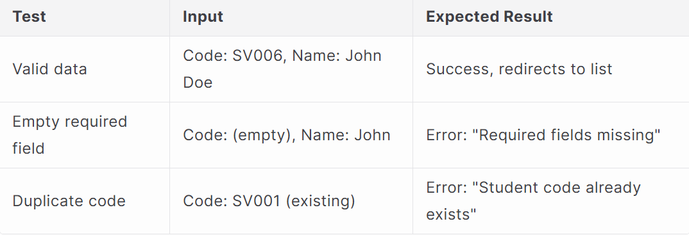
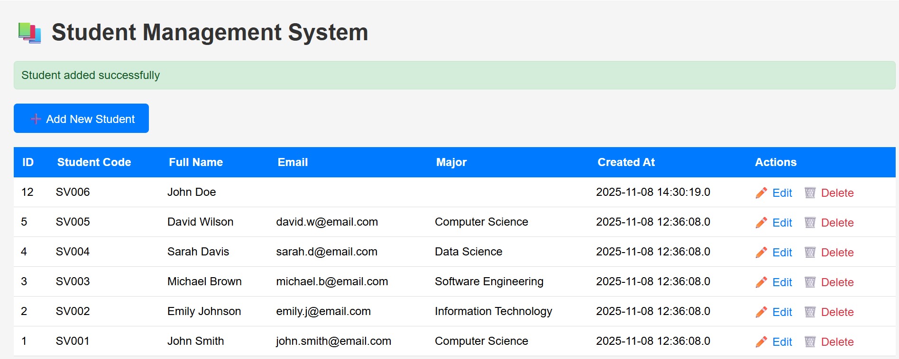
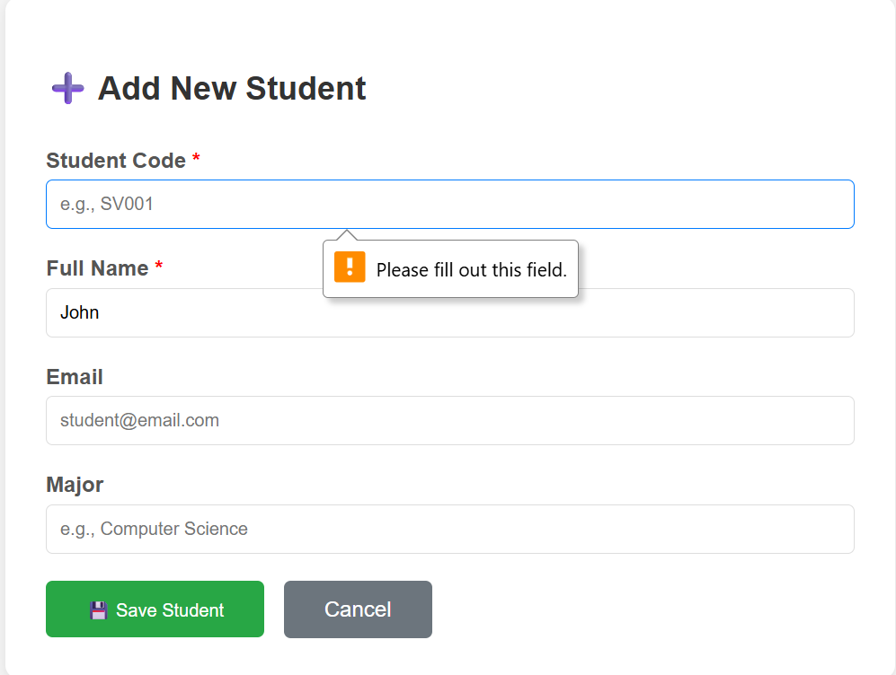
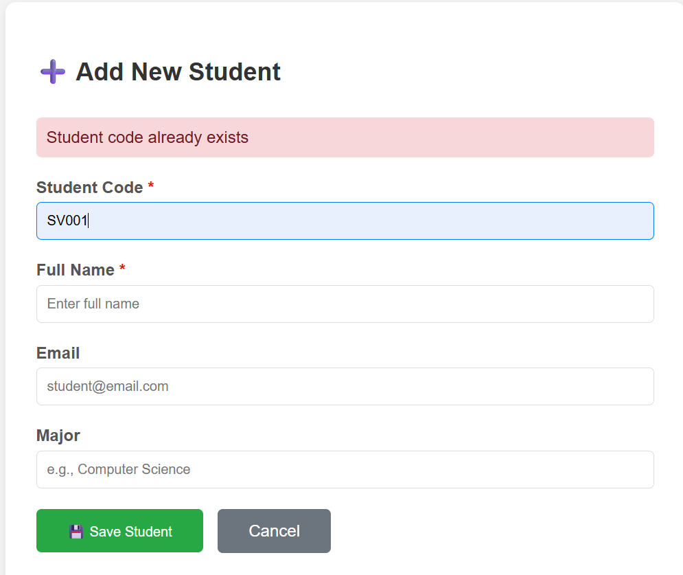
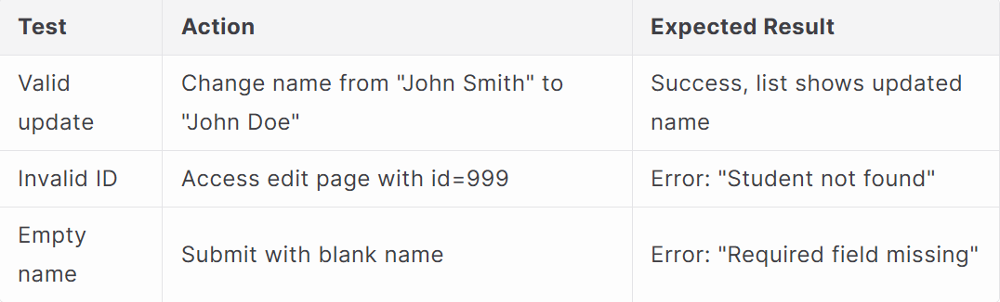
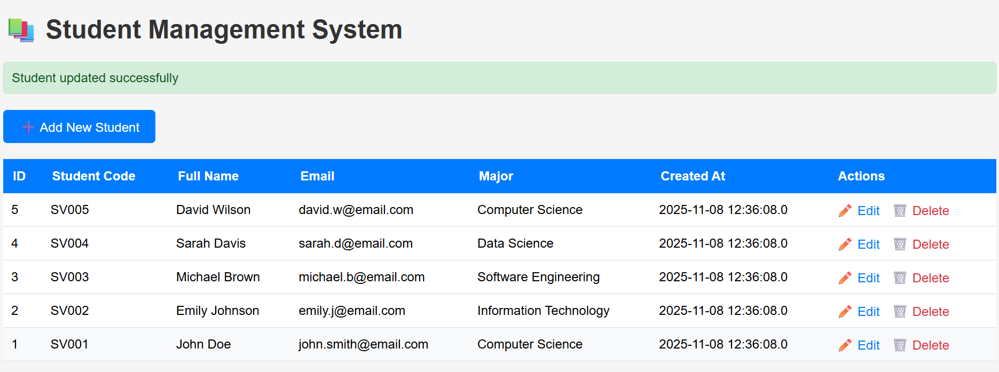
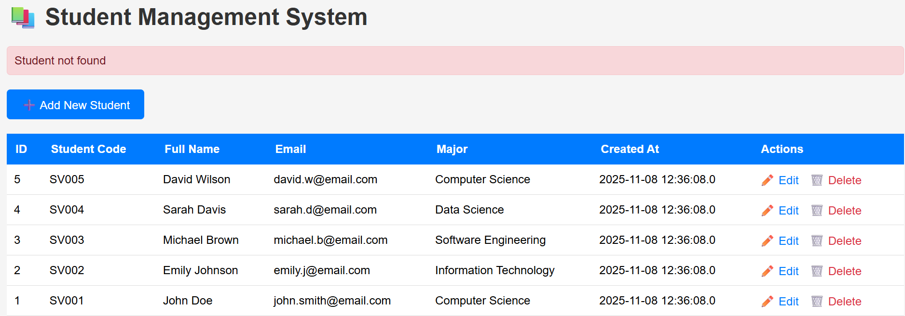
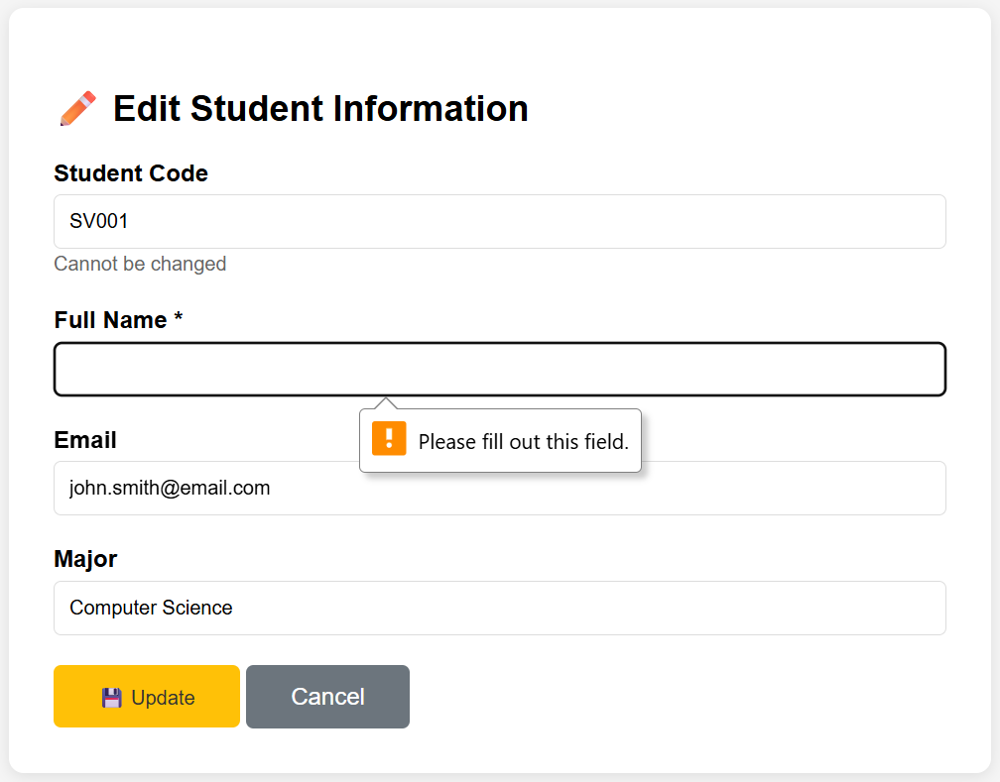
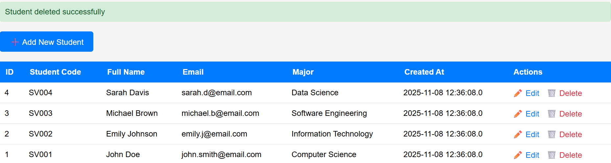

# LAB 4 — SAMPLE CODE REPORT (JSP + MySQL CRUD)

**Course:** Web Application Development  
**Lab Title:** JSP + MySQL — CRUD Operations  
 

---

##  Overview
This sample code demonstrates how to build a **full CRUD (Create, Read, Update, Delete)** web application using **JSP (Java Server Pages)** with **MySQL** as the backend database and **JDBC (Java Database Connectivity)** for communication.  

The provided code examples illustrate:
- How to connect JSP to MySQL  
- How to perform basic CRUD operations securely using `PreparedStatement`  
- How to manage form inputs and validation  
- How to display and style data dynamically in HTML  

---

## 🎯 Objectives

| Objective | Description |
|------------|--------------|
| ✅ Connect JSP with MySQL | Establish a working JDBC connection and perform queries safely. |
| ✅ Implement CRUD | Add, list, edit, and delete student records. |
| ✅ Use PreparedStatement | Prevent SQL injection and improve performance. |
| ✅ Validate Inputs | Ensure clean and safe user input before database operations. |
| ✅ Close Resources | Apply try-with-resources or proper closing for DB connections. |
| ✅ Enhance UX | Build simple, readable pages with confirmation and navigation. |

---

##  Folder & File Structure

```
StudentManagement/
│
├── src/main/webapp/
│   ├── list_students.jsp       → Read all records (Display)
│   ├── add_student.jsp         → Form to add a new student
│   ├── process_add.jsp         → Handles insert operation
│   ├── edit_student.jsp        → Form to update existing record
│   ├── process_edit.jsp        → Handles update query
│   ├── delete_student.jsp      → Handles record deletion
│   └── WEB-INF/web.xml         → Servlet config (optional)
│
└── pom.xml                     → Maven dependency for MySQL Connector/J
```

---

##  Database Configuration

**Database name:** `student_management`  
**Table name:** `students`

```sql
CREATE TABLE students (
  id INT AUTO_INCREMENT PRIMARY KEY,
  student_code VARCHAR(20) NOT NULL,
  full_name VARCHAR(100) NOT NULL,
  email VARCHAR(100),
  major VARCHAR(100),
  created_at TIMESTAMP DEFAULT CURRENT_TIMESTAMP
);
```

**Sample Data:**
```sql
INSERT INTO students (student_code, full_name, email, major) VALUES
('S001', 'Alice Nguyen', 'alice@example.com', 'SE'),
('S002', 'Bob Tran', 'bob@example.com', 'DS'),
('S003', 'Carol Le', 'carol@example.com', 'IS'),
('S004', 'David Pham', 'david@example.com', 'CE'),
('S005', 'Eva Ho', 'eva@example.com', 'CS');
```

---

## ⚙️ Database Connection (used across all pages)

Every JSP file that interacts with the database uses the following standard JDBC setup:

```jsp
<%@ page import="java.sql.*" %>
<%
final String JDBC_URL  = "jdbc:mysql://localhost:3306/student_management?useSSL=false&serverTimezone=UTC";
final String JDBC_USER = "root";
final String JDBC_PASS = "quangthai123";
final String JDBC_DRV  = "com.mysql.cj.jdbc.Driver";

Class.forName(JDBC_DRV);
Connection conn = DriverManager.getConnection(JDBC_URL, JDBC_USER, JDBC_PASS);
%>
```

### Why this setup?
- Ensures a consistent connection for all operations.
- Avoids deprecated `com.mysql.jdbc.Driver`.
- Includes parameters `useSSL=false` and `serverTimezone=UTC` to prevent MySQL timezone and SSL warnings.

---

##  Explanation of Each CRUD Page

### 🟦 1. **list_students.jsp** – READ Operation
**Purpose:** Display all records from the `students` table.

**Logic:**
```jsp
String sql = "SELECT id, student_code, full_name, email, major, created_at FROM students ORDER BY id DESC";
PreparedStatement ps = conn.prepareStatement(sql);
ResultSet rs = ps.executeQuery();
while (rs.next()) {
    // Print rows in table format
}
```
**Workflow**
When the user opens the page, the system connects to the database using JDBC and executes a `SELECT` query to retrieve all student records.
The data is stored in a `ResultSet` and displayed as an HTML table with columns for ID, Student Code, Full Name, Email, Major, and Created At.
Each record is rendered dynamically inside <tr> and <td> tags.
If the database connection fails or no data is found, the page shows a friendly error message instead of crashing.
Finally, all resources (connection, statement, result set) are closed automatically.

**Features:**
- Uses `PreparedStatement` for secure querying.  
- Displays data in an HTML table with all six columns.  
- Handles SQL exceptions gracefully using a `<pre>` error block.  

**Expected Output:**  
A dynamic HTML table showing all students, ordered by descending ID.

---
**Test Case**


###  2. **add_student.jsp + process_add.jsp** – CREATE Operation
**Purpose:** Add a new student record.

**Form (add_student.jsp):**
```html
<form action="process_add.jsp" method="post">
  <input type="text" name="student_code" required>
  <input type="text" name="full_name" required>
  <input type="email" name="email">
  <input type="text" name="major">
  <button type="submit">Add</button>
</form>
```
**Workflow**
When the user clicks `Add Student` the system shows a form for entering a new record.
After submission, the form sends data to `process_add.jsp` using the POST method.
The page validates required fields like `student_code` and `full_name`, and checks that the email format is correct if provided.
A `PreparedStatement` executes an `INSERT` query to save the new student to the database.
If the operation succeeds, the user is redirected back to the list page with a success message; otherwise, an error is displayed.

**Processing (process_add.jsp):**
```jsp
String sql = "INSERT INTO students (student_code, full_name, email, major) VALUES (?, ?, ?, ?)";
PreparedStatement ps = conn.prepareStatement(sql);
ps.setString(1, request.getParameter("student_code"));
ps.setString(2, request.getParameter("full_name"));
ps.setString(3, request.getParameter("email"));
ps.setString(4, request.getParameter("major"));
ps.executeUpdate();
response.sendRedirect("list_students.jsp");
```

**Notes:**
- The server performs input validation before inserting.  
- Redirect follows the **Post/Redirect/Get** pattern to avoid resubmission.

---
**Test Case**





###  3. **edit_student.jsp + process_edit.jsp** – UPDATE Operation
**Purpose:** Modify an existing record.

**Form (edit_student.jsp):**
```jsp
<%
int id = Integer.parseInt(request.getParameter("id"));
String sql = "SELECT * FROM students WHERE id=?";
PreparedStatement ps = conn.prepareStatement(sql);
ps.setInt(1, id);
ResultSet rs = ps.executeQuery();
if (rs.next()) {
%>
<form action="process_edit.jsp" method="post">
  <input type="hidden" name="id" value="<%= id %>">
  <input type="text" name="full_name" value="<%= rs.getString("full_name") %>">
  <input type="text" name="email" value="<%= rs.getString("email") %>">
  <input type="text" name="major" value="<%= rs.getString("major") %>">
  <button type="submit">Update</button>
</form>
<% } %>
```
**Workflow**
When the user clicks `Edit` the system loads the existing student data by reading the id from the URL.
If the ID is invalid or does not exist, the page displays an error like "Invalid ID" or “Student not found.”
Otherwise, a prefilled form appears with the student’s information ready to update.
When the user submits changes, `process_edit.jsp` validates the inputs and executes an UPDATE query using `PreparedStatement`.
After successful updating, the user is redirected back to the list with a message confirming the edit.

**Processing (process_edit.jsp):**
```jsp
String sql = "UPDATE students SET full_name=?, email=?, major=? WHERE id=?";
PreparedStatement ps = conn.prepareStatement(sql);
ps.setString(1, request.getParameter("full_name"));
ps.setString(2, request.getParameter("email"));
ps.setString(3, request.getParameter("major"));
ps.setInt(4, Integer.parseInt(request.getParameter("id")));
ps.executeUpdate();
response.sendRedirect("list_students.jsp");
```

**Features:**
- Data prefilled for better UX.  
- ID kept as hidden (primary key reference).  
- Updates only editable fields.  

---
**Test Case**





###  4. **delete_student.jsp** – DELETE Operation
**Purpose:** Delete a student record using the `id` passed via URL parameter.

```jsp
int id = Integer.parseInt(request.getParameter("id"));
String sql = "DELETE FROM students WHERE id=?";
PreparedStatement ps = conn.prepareStatement(sql);
ps.setInt(1, id);
ps.executeUpdate();
response.sendRedirect("list_students.jsp");
```

**Workflow**
When the user clicks the `Delete` button or link, a confirmation dialog appears to prevent accidental deletion.
If confirmed, the system receives the student’s ID from the URL and validates it.
A `PreparedStatement` executes a `DELETE` query to remove the record from the database.
After deletion, the user is redirected back to the list page where the record no longer appears.
If the ID is invalid or missing, the page displays an error but does not crash.

**Features:**
- URL parameter validation (checks if `id` is numeric).  
- Simple confirmation alert added in the list view:
  ```html
  <a href="delete_student.jsp?id=<%= id %>" onclick="return confirm('Are you sure?')">Delete</a>
  ```

---
**Testing**


##  Technical Highlights

| Concept | Description |
|----------|--------------|
| **PreparedStatement** | Prevents SQL Injection and improves efficiency. |
| **try-with-resources** | Automatically closes `Connection`, `Statement`, `ResultSet`. |
| **Exception Handling** | Shows friendly messages without exposing stack traces. |
| **Post/Redirect/Get** | Prevents duplicate form submissions on refresh. |
| **Validation** | Email regex check and required fields. |
| **Resource Management** | All JDBC objects closed explicitly or in try blocks. |

---

##  How to Run

1. Start MySQL and ensure `student_management` DB exists.  
2. Update `JDBC_USER` and `JDBC_PASS` in JSP files if necessary.  
3. Run project on **Tomcat 10** via IntelliJ or NetBeans.  
4. Access the pages:
   ```
   /list_students.jsp
   /add_student.jsp
   /edit_student.jsp?id=1
   /delete_student.jsp?id=2
   ```

Expected: Full CRUD flow works with no SQL or runtime errors.

---

##  Troubleshooting

| Issue | Cause | Fix |
|--------|--------|-----|
| `ClassNotFound: com.mysql.cj.jdbc.Driver` | Connector not loaded | Add MySQL dependency to `pom.xml` |
| `Communications link failure` | MySQL not running | Start MySQL service |
| Empty table | Wrong DB/table name | Check SQL schema |
| Timezone/SSL warning | Missing params in JDBC URL | Add `?useSSL=false&serverTimezone=UTC` |

---

##  Conclusion
This **Sample Code** section successfully demonstrates a complete CRUD cycle using **JSP and MySQL** with clean, modular structure and JDBC best practices:
- Secure DB access  
- Validation & exception handling  
- Proper closing of resources  
- Simple, functional UI  


